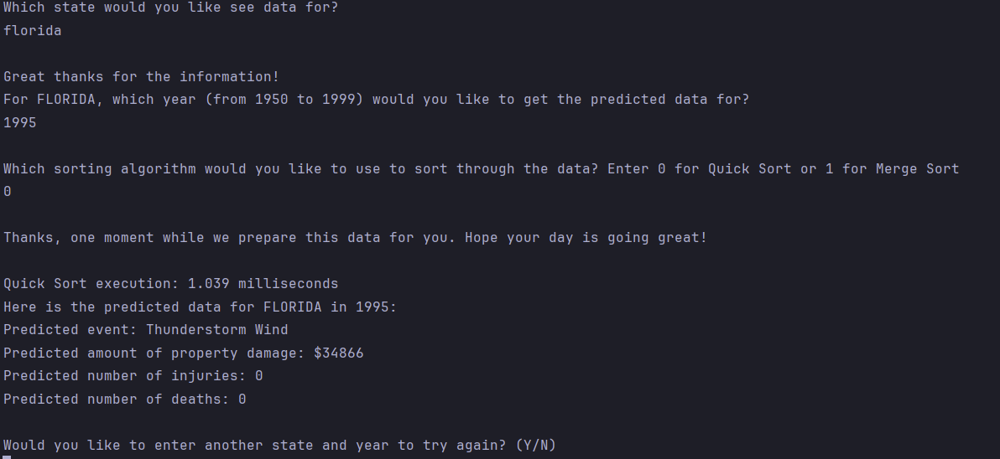

# Storm-Predictor
-------

Storm Predictor is a console application that aims to provide a predicted weather event and its estimated damages from 1950-1999. 

## Table of Contents
-------
- [Interface](#interface)
- [Installation](#installation)
- [How it works](#how-it-works)
- [Data Structures Used](#data-structures-used)
- [Data](#data)
- [Preprocessing](#preprocessing)

## Interface
-------


## Installation
-------
To use the Storm Predictor application, follow these installation steps:

1. Clone the repository to your local machine:
```bash
git clone git@github.com:wilfredogao/Storm-Predictor.git
```
2. Navigate to the project directory:
```bash
cd Storm-Predictor/
```
3. Run the executable
```bash
./predictor.exe
```

## How it works
-------
The prediction is based off user input of a given state and year. Then using this input, our application analyzes the most common weather event that occured within that state in the last 10 years from the user given year. 
After analysis, the application outputs the predicted event to occur in that year and its associated qualities: property damage, number of injuries, and number of deaths.

## Data Structures Used
-------
* Maps-
  * Our data was contained within a map where the keys were state names and the values were class objects containing the weather data.
* Algorithms-
For our comparison purposes, we used 2 different algorithms:

  ~Heap Sort

  ~Quick Sort

## Data
-------
Our console application uses data provided by the National Centers for Environmental Information(NCEI). This [data](https://www.ncei.noaa.gov/pub/data/swdi/stormevents/csvfiles/) is provided in csv format and has been compressed. 

## Preprocessing
-------
* For our data preprocessing, we ran a python program to download all the provided storm events details provided labelled 'StormEvents_details-ftp'.
* After download, we used 7-zip to extract all compressed csv files into one folder.
* After extraction, we used a python program to combine all csv files into one. 
* After combining the cvs files, we used python's panda library to fill in any missing entries with data values of -100.
